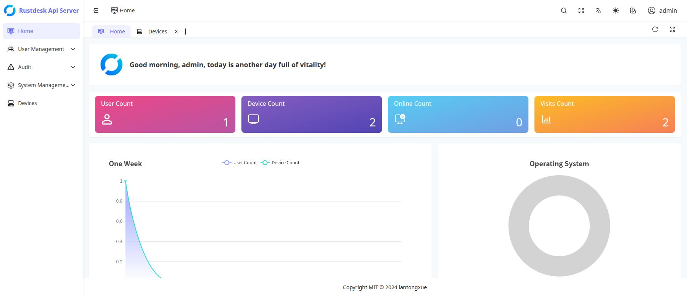

# RustDesk API Server Pro

[English](README.md) | [简体中文](README_CN.md)

This fork builds on [lantongxue/rustdesk-api-server-pro](https://github.com/lantongxue/rustdesk-api-server-pro). Thank you to the original author and contributors for the API server and Web management foundation, and to the [RustDesk](https://github.com/rustdesk/rustdesk) open-source project.

This README lists only changes and additions in this fork. Refer to the original project for its baseline features and general usage documentation.

## Changes and additions

- **Automatic enrollment for managed Android devices**
  - A customized Android client obtains its initial API address through encrypted `rud.cfg`, without a prior user login.
  - Devices use individual signing credentials for heartbeat, system information and subsequent policy retrieval, with signature verification, replay protection and encrypted policy delivery.

- **Device groups and multiple server profiles**
  - Manage complete profiles containing ID Server, Relay Server, Server Key and a permanent password in the Web UI.
  - Select profiles at global, group or device scope. A device chooses one complete profile in device → enabled group → global order, without mixing individual fields.
  - Change group or direct-profile assignments from the device list; moving a device does not clear its direct profile.
  - Preview effective settings and their source. Permanent passwords are encrypted at rest and are not returned in plaintext by management queries.

- **Per-device unattended management**
  - Configure unattended mode and its Root executor in the Web UI for the managed client to apply.
  - View Root, screen capture, accessibility, all-files access, service readiness and the latest reported result.
  - Private Android builds check and request storage permissions; missing permissions must not be reported as complete unattended success.

- **Device disable and enable operations**
  - Add management state, filtering and confirmed disable/enable actions.
  - Disabling a device disables its credential and rejects subsequent enrollment, heartbeat and system-information reports, while preserving groups, policies and history.
  - State changes and audit records are saved transactionally.

- **Web-managed device names and address-book publishing**
  - Edit, clear and search device names in Web device management, including Chinese names.
  - Administrators explicitly select target accounts' personal address books. Existing passwords, tags and other personal fields are preserved.
  - Web-managed names take precedence; stale client writes cannot overwrite them.
  - Device names do not change connection IDs. Connecting users can log in with an official client, refresh their address book and find devices by name.

- **Managed connection IDs**
  - Assign a one-time connection ID to an enrolled managed Android device from Web device management, with pending, applied and failed states.
  - The client reuses RustDesk's existing ID-change protocol against the active ID Server and saves the new ID only after confirmation; failures retain the old ID and can be retried.
  - Keep hbbs 1.1.11 unchanged. An official connecting client configured with the same ID Server, key and relay can dial the applied ID without a custom build.
  - Bind device identity to its numeric ID, public key and UUID so changing the connection ID does not create a duplicate device; managed address-book entries follow a successful change.

- **Restricted single-device deletion**
  - Only disabled, offline devices can be deleted, after entering the complete RustDesk ID for confirmation.
  - Remove the device, credential and managed address-book associations transactionally. Retain audit history and pre-existing personal entries; only entries created by management are deleted.

- **Build and local validation**
  - Package a static Linux amd64 API server with the Web frontend, avoiding a dependency on the build machine's glibc version.
  - Add tests for device lifecycle, name publishing, connection IDs, permission reporting, transaction rollback and concurrent consistency.
  - Add mocked-API browser tests. Real full-stack Playwright integration remains optional, not a normal packaging dependency.
  - Serialize local SQLite transactions through its connection pool to reduce concurrent write-lock conflicts.

## Scope and limitations

- Automatic enrollment, unattended mode and storage policies require the accompanying managed Android client; these are not promised as stock-client capabilities.
- Device names are only for Web and address-book identification; only an applied connection ID can be dialed directly. The controlled device requires the managed Android APK, while the official connecting client does not require customization.
- The connection-ID flow uses the existing hbbs 1.1.11 protocol, but real policy delivery, ID Server update and official-client dialing still require deployment-level acceptance testing.
- The API Server is a fixed control channel and is not changed by server-profile policy.
- Disabling limits management API access, not necessarily existing remote sessions. Deletion is not a permanent ban; a client may enroll again.
- Historical-data migration is not provided during development. Never commit private addresses, keys, passwords or configuration files to a public repository.

See the [device-management TODO](docs/device-management-todo.md) and [implementation record](docs/device-management-progress.md) for details.

See the repository [LICENSE](LICENSE) for license terms.
