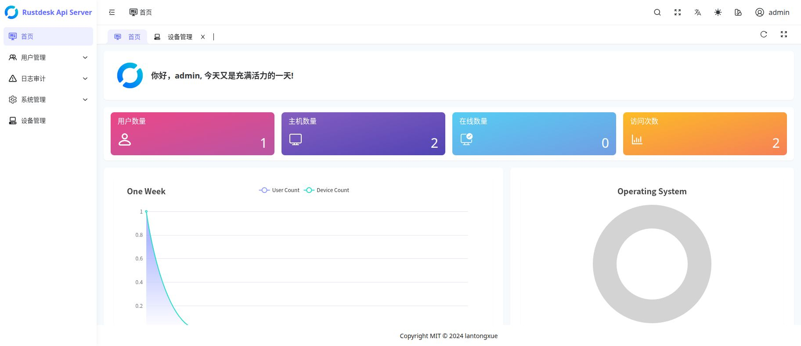

# RustDesk API Server Pro

[English](README.md) | [简体中文](README_CN.md)

本项目基于 [lantongxue/rustdesk-api-server-pro](https://github.com/lantongxue/rustdesk-api-server-pro) 二次开发。感谢原作者及所有贡献者提供的 API 服务和 Web 管理基础，也感谢 [RustDesk](https://github.com/rustdesk/rustdesk) 开源项目。

本文只列出本分支的改动与新增功能，原项目的基础功能和通用使用说明请参阅原项目。

## 改动与新增功能

- **受管 Android 设备自动注册**
  - 配合定制 Android 客户端，通过加密 `rud.cfg` 获取初始 API 地址，无需预先登录用户账号。
  - 注册后使用设备独立签名凭据上报心跳、设备信息和获取后续策略，增加签名校验、防重放及加密策略下发。

- **设备组与多套服务器配置**
  - 在 Web 中维护 ID Server、Relay Server、Server Key 和永久密码组成的完整配置。
  - 支持全局默认、设备组和单设备配置选择，按“单设备 → 已启用设备组 → 全局”选择整套配置，不逐字段混合。
  - 在设备列表直接切换分组或设备级配置；切换分组不清除设备级配置。
  - 提供最终生效配置及来源预览；永久密码加密保存，管理查询不返回明文。

- **单设备无人值守管理**
  - Web 配置无人值守开关及 Root 执行器，配合受管客户端应用策略。
  - 展示 Root、屏幕采集、无障碍、所有文件访问权限、服务运行状态和最近上报结果。
  - 配合私有 Android 构建检查与申请文件权限；权限不足时不应报告无人值守完全成功。

- **设备停用与重新启用**
  - 增加管理状态、状态筛选、停用和启用操作。
  - 停用时禁用设备凭据，拒绝后续注册、心跳及信息上报；保留设备组、策略和历史记录。
  - 操作与审计在同一事务中保存。

- **Web 设备别名与地址簿同步**
  - 在设备管理中编辑、清空和搜索别名，支持中文。
  - 管理员明确选择发布到哪些账号的个人地址簿；同步时保留已有条目的密码、标签等信息。
  - 受管名称以 Web 为准，客户端回写旧别名不会覆盖管理端设置。
  - 实际 RustDesk ID 不变；连接方使用官方客户端登录并刷新地址簿后，可搜索别名、选择设备连接。

- **受限制的单设备删除**
  - 仅允许删除已停用、离线的设备，要求输入完整 RustDesk ID 二次确认。
  - 事务内清理设备、凭据及受管地址簿关联，保留历史审计和原有个人条目；仅删除管理功能新建的地址簿条目。

- **构建与本地验证**
  - 提供 Linux amd64 静态服务端与 Web 打包，避免依赖编译机的 glibc 版本。
  - 补充设备生命周期、别名同步、权限状态、事务回滚及并发一致性测试。
  - 增加模拟接口页面测试；真实全栈 Playwright 联调作为可选测试，不是日常打包依赖。
  - SQLite 连接池串行执行本地事务，减少并发写锁冲突。

## 功能边界

- 自动注册、无人值守和文件权限策略需要配套受管 Android 客户端；不表示官方客户端自动支持这些定制能力。
- 别名不是 Custom ID，不修改 hbbs，不承诺直接输入别名连接；官方客户端无需为别名地址簿功能重新打包，实际登录、刷新与连接仍需部署后联调验收。
- API Server 是固定控制通道，不随服务器配置策略切换。
- 停用只限制管理 API 访问，不保证断开已有远程会话；删除记录不是永久封禁，客户端以后仍可能重新注册。
- 开发阶段不提供历史数据迁移。私有地址、密钥、密码和配置文件不得提交到公共仓库。

详细范围见 [设备管理 TODO](docs/device-management-todo.md) 和 [实施记录](docs/device-management-progress.md)。

许可条款见仓库 [LICENSE](LICENSE)。
